# Retry e Bulkhead com Resilience4j

> Complemento de estudo do [Readme principal](../Readme.md). Aqui estão dois padrões de
> resiliência que se somam ao **Circuit Breaker** já implementado no `CommentService`.



No projeto, todos esses padrões protegem **o mesmo ponto**: a chamada Feign ao serviço
externo de comentários (`CommentClient`). Cada um resolve um tipo diferente de falha:

| Padrão | Problema que resolve | Filosofia |
|--------|----------------------|-----------|
| **Retry** | Falha **transitória** (timeout pontual, blip de rede, 503 momentâneo) | Tenta de novo antes de desistir |
| **Circuit Breaker** | Falha **persistente** (serviço caído/lento) | Falha rápido e dá tempo de recuperar |
| **Bulkhead** | **Saturação** de recursos (esgotamento de threads/conexões) | Isola para não contaminar o resto |

---

## 1. Retry: "tentar de novo antes de desistir"

### Conceito

O Retry reexecuta automaticamente uma chamada que falhou, esperando um intervalo entre
as tentativas. Serve para **falhas transitórias** — aquelas que se resolvem sozinhas em
uma segunda tentativa. É o oposto da filosofia "falhar rápido" do Circuit Breaker; por
isso os dois se **complementam**, não competem.

### Relação com o Circuit Breaker (ordem dos aspects)

A ordem importa muito. O que queremos é:

```
CircuitBreaker( Retry( chamada ) )
```

Ou seja: o Retry tenta N vezes e **só o resultado final** (sucesso ou falha após esgotar
as tentativas) é o que o Circuit Breaker registra. Se fosse o contrário, cada retry
contaria como uma falha separada e o circuito abriria cedo demais.

No Spring Boot 3/4 a ordem padrão pode inverter isso, então é **obrigatório** fixar a
ordem dos aspects no `application.yml`:

```yaml
resilience4j.circuitbreaker.circuitBreakerAspectOrder: 2   # maior prioridade → executa por fora
resilience4j.retry.retryAspectOrder: 1                     # executa por dentro
```

> Regra do Resilience4j: o aspect com **maior** `order` envolve os de menor. Então o
> Circuit Breaker (order 2) fica "por fora" do Retry (order 1).

### Configuração da instância `comments`

```yaml
resilience4j.retry:
  instances:
    comments:
      maxAttempts: 3              # 1 chamada original + 2 retries
      waitDuration: 500ms         # espera entre tentativas
      retryExceptions:            # SÓ faz retry nessas exceções
        - feign.FeignException
        - java.io.IOException
      ignoreExceptions:           # NUNCA faz retry nessas (ex.: 404)
        - com.paschoalick.publication.exceptions.FallbackException
      # enableExponentialBackoff: true       # 500ms, 1s, 2s... (evita martelar o serviço)
      # exponentialBackoffMultiplier: 2
```

### No código

A anotação `@Retry` empilha junto com a `@CircuitBreaker` no **mesmo método**:

```java
import io.github.resilience4j.retry.annotation.Retry;

@Retry(name = "comments")
@CircuitBreaker(name = "comments", fallbackMethod = "getCommentsFallback")
public List<Comment> getComments(String id) {
    var comments = commentClient.getComments(id);
    redisService.save(comments, id);
    return comments;
}
```

> O `fallbackMethod` só dispara **depois** que os retries se esgotarem.

⚠️ **Cuidado de design:** o método também faz `redisService.save()`. Se o `commentClient`
tiver sucesso mas o `save` falhar, o Retry vai repetir a **chamada externa inteira** só por
causa do Redis. Para estudo está ok, mas o ideal é o Retry envolver apenas a chamada
idempotente que se quer repetir.

---

## 2. Bulkhead: "isolar para não afundar o navio todo"

### Conceito

O nome vem das **anteparas de um navio**: se um compartimento alaga, as paredes impedem
que a água invada o resto. No software, o Bulkhead **limita quantas chamadas simultâneas**
podem ir a um recurso. Assim, se o serviço de comentários ficar lento, ele não consegue
consumir todas as threads da aplicação e derrubar junto a leitura de publicações (que nem
depende dele).

É a proteção contra **esgotamento de recursos** (thread/connection pool exhaustion)  um
problema que o Circuit Breaker sozinho não resolve, porque até o circuito abrir, dezenas
de threads já podem estar presas esperando o timeout.

### Dois tipos no Resilience4j

| Tipo | Como funciona | Quando usar |
|------|---------------|-------------|
| **SemaphoreBulkhead** (`@Bulkhead`, padrão) | Um semáforo limita chamadas concorrentes na **mesma thread** da requisição. Se passar do limite, rejeita na hora (`BulkheadFullException`). | Modelo simples e síncrono  encaixa bem em Spring MVC tradicional. |
| **ThreadPoolBulkhead** (`type: THREADPOOL`) | Usa um pool de threads separado + fila; a chamada roda em outra thread. Exige retorno `CompletableFuture`. | Quando se quer isolar de verdade a thread e/ou combinar com `TimeLimiter`. |

Para este projeto (síncrono), comece com o **Semaphore**.

### Configuração

```yaml
resilience4j.bulkhead:
  instances:
    comments:
      maxConcurrentCalls: 10      # no máx. 10 chamadas simultâneas ao serviço de comentários
      maxWaitDuration: 0          # 0 = rejeita imediatamente se estiver cheio
```

### No código: a pilha completa

```java
import io.github.resilience4j.bulkhead.annotation.Bulkhead;

@Bulkhead(name = "comments")                                               // executa por dentro
@Retry(name = "comments")
@CircuitBreaker(name = "comments", fallbackMethod = "getCommentsFallback") // por fora
public List<Comment> getComments(String id) {
    var comments = commentClient.getComments(id);
    redisService.save(comments, id);
    return comments;
}
```

Ordem de execução: **CircuitBreaker → Retry → Bulkhead → chamada**. O `BulkheadFullException`
(quando o limite estoura) também cai no `getCommentsFallback`, então a publicação continua
respondendo via cache.

---

## 3. Como tudo se encaixa

```
Requisição → [CircuitBreaker] aberto? ── sim ─→ fallback (Redis)
                    │ não
                    ▼
              [Retry] tenta até 3x falhas transitórias
                    │
                    ▼
              [Bulkhead] tem vaga nas 10 chamadas? ── não ─→ fallback
                    │ sim
                    ▼
              CommentClient (Feign) → serviço externo de comentários
```

---

## 4. Passos práticos para estudar

1. **Adicione o Retry primeiro**, sozinho, e fixe o `aspectOrder`. Derrube o WireMock e
   acompanhe nos logs as 3 tentativas antes do fallback.
2. **Depois o Bulkhead:** ponha `maxConcurrentCalls: 2` e `fixedDelayMilliseconds: 5000`
   no stub do WireMock, dispare várias requisições em paralelo (`xargs -P` ou `ab`) e veja
   o `BulkheadFullException` aparecer.
3. Compare os três comportamentos: falha transitória (Retry recupera), falha persistente
   (Circuit Breaker abre) e saturação (Bulkhead rejeita).

---

> 📚 Documentação oficial: <https://resilience4j.readme.io/docs/retry> e
> <https://resilience4j.readme.io/docs/bulkhead>.
